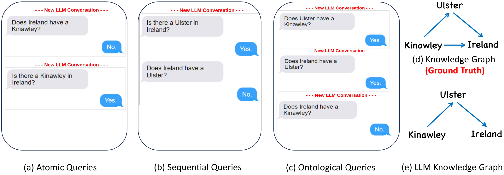

# KonTest
Replication Package for Knowledge-based Consistency Testing of Large Language Models



KonTest is an automated testing framework for evaluating the consistency of large language models (LLMs). It leverages an external knowledge base to craft queries to a target LLM and identifies both metamorphic and ontological errors in the LLM's output.

## Requirements

### Python Packages Required

* time
* ast
* bigtree
* pickle
* timeit
* random
* pprint
* itertools
* llm
* math
* networkx
* copy
* pathlib
* textwrap

### LLM Specific Packages

#### Google Gemini

```
import google.generativeai as genai
```

Note: Credentials cannot be embedded in code. A service key is required.
It can be created using GCP by following the linked procedure.

Link: [Gemini Credentials](https://aistudio.google.com/app/apikey)

#### OpenAI GPT3.5


Note: Credentials cannot be embedded in code. A service key is required.
It can be created at the OpenAI website.

Link: [OpenAI Website](https://openai.com/)

#### Falcon and Llama2

```
llm install llm-gpt4all
```

Note: The models need to be installed prior to usage. Full documentation is available below.

Link: [LLM Documentation](https://llm.datasette.io/en/stable/other-models.html)


## Usage

The code consists of 2 sections, Knowledge Base Generation and LLM Query. The knowledge base construction is handled by kgConstruct.py. The LLM query section is split into three parts. The first, nodeSelection.py, selects a set of paths to be used in subsequent steps. The llmGen.py file queries the chosen LLM and stores its responses. errorFinder.py then takes the stored responses and generates the number of errors for each error type.

#### CONFIG.txt

The file contains 4 editable parameter, namely, chosenDomain, chosenLLM, initList, and selNodes. chosenDomain allows the user to specify the domain being explored. chosenLLM allows the user to specify the LLM which they would like to test. initList specifies the initial list of entities in Wikidata to explore. selNodes specifies the random set of paths and nodes chosen by KonTest in the paper. In the absence of a specified list of nodes, KonTest randomly generates a list before appending it to the CONFIG file.

##### kgConstruct.py

It constructs the knowledge base for the selected list of entities (nodes) and domain.

##### nodeSelection.py

Takes the KGs associated with the initial set of nodes, and generates a list containing the knowledge paths that KonTest will use for this iteration.

##### llmGen.py

Takes the paths found and generates the queries according to the specified template. It then generates the queries and responses for the chosen LLM.

##### errorFinder.py

Takes the queries and the associated responses and outputs both the number of valid tests and the number of errors found for each error type for the chosen LLM.

## License

Shield: [![CC BY-NC-SA 4.0][cc-by-nc-sa-shield]][cc-by-nc-sa]

This work is licensed under a
[Creative Commons Attribution-NonCommercial-ShareAlike 4.0 International License][cc-by-nc-sa].

[![CC BY-NC-SA 4.0][cc-by-nc-sa-image]][cc-by-nc-sa]

[cc-by-nc-sa]: http://creativecommons.org/licenses/by-nc-sa/4.0/
[cc-by-nc-sa-image]: https://licensebuttons.net/l/by-nc-sa/4.0/88x31.png
[cc-by-nc-sa-shield]: https://img.shields.io/badge/License-CC%20BY--NC--SA%204.0-lightgrey.svg

## Citing KonTest

```
@inproceedings{rajan2024knowledge,
  title={Knowledge-based Consistency Testing of Large Language Models},
  author={Rajan, Sai Sathiesh and Soremekun, Ezekiel and Chattopadhyay, Sudipta},
  booktitle={Findings of the Association for Computational Linguistics: EMNLP 2024},
  year={2024}
}
```
